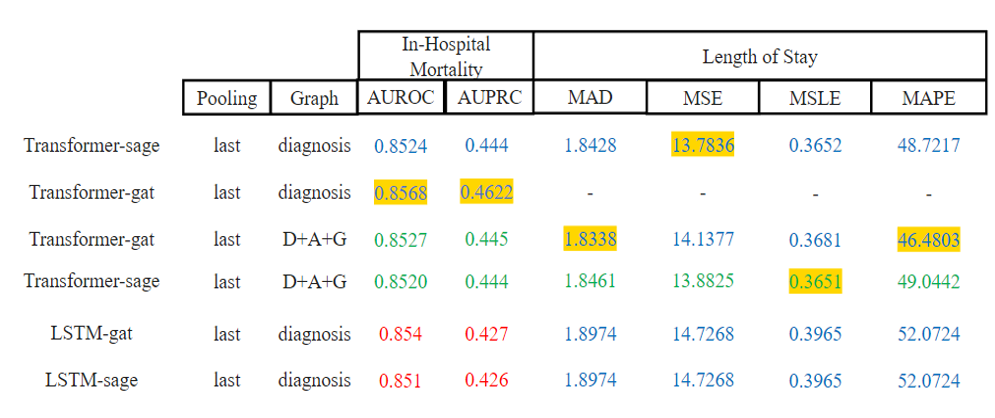

- Abstract
    
    <aside>
    💡 The goal of our work is to use Graph Neural Networks (GNNs) to predict outcomes like In-Hospital Mortality (IHM) and Length Of Stay (LOS) in the Intensive Care Unit (ICU) collected from the eICU dataset. Recent work (Rochetau et al.) on using GNNs to predict patient outcomes on the eICU dataset only uses shared diagnosis to extract patient relationships and does not leverage other valuable features (i.e.,age, gender) during graph construction. Our goal, therefore, was to improve the performance of existing methods on the IHM and LOS tasks by leveraging a better graph and a more robust deep learning architecture for the time series data (i.e., vital signs). We propose a graph in which the node’s value is the patient’s record representation predicted by a Transformer network and the edges are connected by a pairwise similarity score based on diagnosis occurrence, gender, and age. We then use the GNN for predicting the downstream LOS and IHM tasks. We demonstrate that the Transformer-GNN model outperforms the LSTM-GNN baseline on both tasks. Moreover, the optimal performance is achieved when both the method of calculating the node value and getting the edge connections are changed from the baseline.
    We also get a performance boost using age and gender in addition to diagnosis occurrence in our graph construction. Our results indicate that constructing a patient graph using additional demographic information and leveraging a Transformer network to learn representations of the temporal data are promising future directions.
    
    </aside>
    

### What

---

- Through Summer 2022 Global Research Experience in Artificial Intelligence (GREAT) Program We did a research project with graduate students from the Health SciTech Group as visiting researchers, UC Irvine
- using the eICU Collaborative Research Database we predicted patient’s length of stay and In-hospital mortality.
- research based on **predicting patient outcomes with graph representation learning**

### How

---

- clinicians tend to rely on their past experience of treating similar patients
when making clinical judgments
    - based on this Idea, previous research made a relationship between patients with diagnoses.
    - Our research added Age and Gender to consider while making a graph relationship
- Previous research used basic RNN and LSTM for time series data
    - following the recent success of the transformer, we developed a transformer-based ICU time series data feature extractor for extracting the node feature.
- Using the graph generated in the previous step and the static features(gender, height, weight, and more) of the patients, we predicted patient outcomes using various Graph Neural Networks such as GAT, GraphSage

### Model Architecture

---


### Result

---



- We outperformed previous research using Our eICU-GNN-Transformer.
    - during the creation of the graph, we had questions about data leakage. The problem point was the calculation of the coefficients of gender and age. we calculated coefficients using a simple regression algorithm using the length of the stay, which was one of the labels.
But I don't think this is a data leakage. Because we calculated these coefficients from training data only and used this value for selecting top-k similar patients for Graph creation later
- Blue → hyperparameter tuned result
Green → non-hyper parameter tuned result
Yellow box → highest score
Red → Performance from the previous research

### My role

---

- development of the Transformer
- Training process of the whole model
- Establishing an Experimental Environment

``` 
@misc{rocheteautong2021,
      title={Predicting Patient Outcomes with Graph Representation Learning}, 
      author={Emma Rocheteau and Catherine Tong and Petar Veličković and Nicholas Lane and Pietro Liò},
      year={2021},
      eprint={2101.03940},
      archivePrefix={arXiv},
      primaryClass={cs.LG}
}
```
